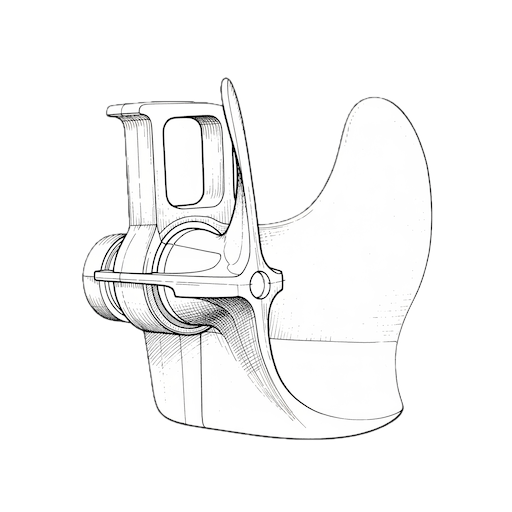

⚠️ This project is under development, and I am not taking feature requests.

# CRUDR - Steering OpenAPI Development from the CLI

A suite of tools for maintaining OpenAPI specs, servers, and clients

## Napkin sketch of the ideas
- a form-based tui, backed by script-ready cli commands
- CRUD wizard that creates a copy of the openapi spec you are working on, presents a diff, and when approved, merges the changes into the original
    - endpoints
    - schemas
    - etc
- shows previews of generable code, given selection of tools+options (e.g. https://github.com/OpenAPITools/openapi-generator/tree/master/modules/openapi-generator-maven-plugin)

Eventually...
- a chat bot that can guide you through all* the processes around CRUD'ing an OpenAPI codebase
- programmed against open-llm (which has the same REST bindings as the big boys)
- understands if it is invoked when pwd is/isn't an OpenAPI project
- does RAG with sources like
    - the project's spec(s)
